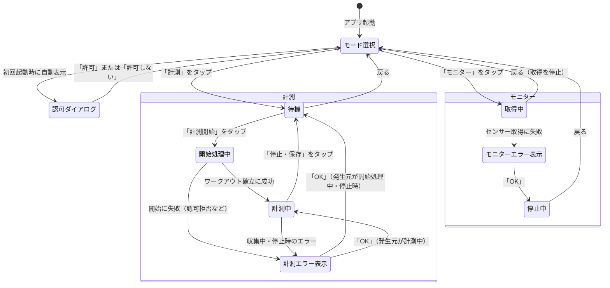

# Watch 画面カタログ

**状態: 現行**（2026-07-27 作成 / 2026-08-01 Apple のガイドラインに沿った版へ更新）

Watch アプリの画面・状態・操作の一覧。**改善要望を画面単位でやり取りするための呼び名**を定める。
指定は「画面名/状態名 の 要素名」の形で行う（例: `計測/計測中 の停止ボタン`）。

関連: [F-W1〜W9 の要求](REQUIREMENTS.md#52-watch-側)

> **スクリーンショットは載せない。** UI を触るたびに古くなり、PNG では差分が読めないため。
> 見た目は SwiftUI プレビューで確認する（各 View に `#Preview` がある）。

---

## 1. 画面

遷移する画面は3つ。うち計測が3状態、モニターが2状態を持つ。

| 画面 | 役割 | ソース |
|---|---|---|
| **モード選択** | 起動直後。計測とモニターのどちらを使うか選ぶ | `RootView.swift` |
| **計測** | スイングを記録する（F-W1〜W6） | `ContentView.swift` |
| **モニター** | 加速度・角速度を波形で見る。保存しない（F-W9） | `SensorMonitorView.swift` |

計測とモニターは**同時に使えない**。モニターは `CMMotionManager`、計測は `CMBatchedSensorManager`
を使い、並走すると 200Hz の計測レートへ影響しうるため（詳細は 4章）。

---

## 2. 状態遷移図

ノードは画面と状態、有向エッジは操作。

図に現れない事実:

* **開始処理中・計測中からモード選択へ戻る辺は無い。** ナビゲーションバーごと隠しているため、
  停止・保存を経由するしかない。
* エラー表示はアラートであり、下に元の状態が残る。そのため戻り先が発生元によって分かれる。
* スクロールは状態も表示内容も変えないため辺に含めない。モニターの左右スワイプも
  同様で、入れ替わるのは表示するグラフだけである（加速度 ⇄ 角速度）。
* **モニターに一時停止・再開の操作は無い。** 停止中はセンサー取得に失敗した後だけの状態で、
  自分から戻る道は無い（モード選択へ戻ってから開き直す）。
* **縦軸スケールに関わる操作は無い。** 表示中の波形に合わせて自動で決まる（4章）。
* 認可ダイアログは iOS のシステム表示（初回起動時のみ）。

---

## 3. 画面ごとの構成要素

### 3.1 モード選択

状態を持たない。カード2枚のカルーセルで、縦スクロール（Digital Crown）で送る。

| 要素 | 内容 |
|---|---|
| ナビゲーションバー | 「Tennis Analyser」。戻るは無い |
| 計測カード | 92pt のカード。緑のアイコン＋「計測」「スイングを記録」→ 計測画面へ |
| モニターカード | 92pt のカード。シアンのアイコン＋「モニター」「波形を見る」→ モニター画面へ |

手前に来た1枚だけを不透明で描き、外れた枚は 60% へ落とす。いま選んでいるのがどれかを
位置ではなく濃さで示すため。

`List` ではなく `ScrollView` で組む。標準の行背景と選択ハイライトがガラスの面と重なり、
板が二重に見えるため（4章）。

### 3.2 計測

#### 待機（`!isRecording && !isStarting`）

| 要素 | 内容 |
|---|---|
| ナビゲーションバー | 「計測」。左端の戻るでモード選択へ |
| アイコン | ガラスの円（56pt）の中にテニスの人物（緑） |
| 説明文 | 「スイングを記録します」 |
| 計測開始ボタン | 緑のベタ塗りのピル（文字は黒）。押すと開始処理中へ |

#### 開始処理中（`isStarting`）

ヘルスケアの認可待ちとワークアウトセッション確立中。通常は一瞬で計測中へ移る。

| 要素 | 内容 |
|---|---|
| インジケーター | ガラスの円（56pt）の中に円形のプログレス（緑） |
| 見出し | 「準備中...」 |
| 補足 | 「ヘルスケアの許可が求められる場合があります」 |

#### 計測中（`isRecording`）

要点であるスイング数を先に置き、その内訳を時系列の棒で下に添える（HIG Charts）。

| 要素 | 内容 |
|---|---|
| 状態行 | 画面上端。点滅する赤いドット・経過時間 `MM:SS`・未転送数「残 m」・実測Hz |
| レート | 状態行の右端。1%未満=白 / 5%未満=黄 / それ以上=赤。ロス率の数値は出さず色だけで示す |
| スイング | 見出し「スイング」と検知数（等幅の大きな数字）＋「回」。右に「直近15秒 n」 |
| 棒グラフ | 15秒ごとの検知数を12本（＝直近3分）。最新の1本だけ濃い緑、残りは 45%。計測開始前の窓は白 6% の細い棒 |
| 平均の破線 | 棒グラフを横切る。表示中の窓の平均 |
| 時間軸 | グラフの下に「-3分」「平均 n.n」「現在」 |
| 停止・保存ボタン | 赤 15% の面に赤い文字のピル。押すと待機へ戻る |

縦軸の上限は 1窓 12回（4秒に1回）を下限に、超えたら実測へ合わせる。
記録が続いていることは、リングではなく点滅する赤いドットで示す。

### 3.3 モニター

**1画面1グラフ。** 波形を画面いっぱいに敷き、加速度と角速度は左右のスワイプで
入れ替える。ページが変わるとナビゲーションバーのタイトルも変わる。

#### 取得中（`isRunning`）

| 要素 | 内容 |
|---|---|
| ナビゲーションバー | ページ名「加速度」「角速度」。左端の戻るでモード選択へ |
| 波形 | 画面全面に3軸を重ねた1枚。X=赤 / Y=緑 / Z=シアン。中央が0、右端が最新、横軸3秒。縦軸は自動調整 |
| 現在値 | 画面下端の幕の上に X / Y / Z の数値 |
| 状態行 | 緑のドットと「取得中」。右に単位・スケール・ページの点 |
| スケール | 「±4g」「±500」など。現在の縦軸を示す表示のみで、操作はできない |
| ページの点 | 2つ。現在のページが緑 |

下端の幕（黒へのグラデーション）は画面の下端まで伸ばす。安全領域で止めると、
その下に残る波形だけが素のまま明るく見えるため。

#### 停止中（`!isRunning`）

センサー取得に失敗し、エラー表示の「OK」を押した後の状態。

| 要素 | 内容 |
|---|---|
| 波形 | 停止した時点の3秒間が残る。流れない。スケールも止まった時点のまま |
| 状態行 | ドットが灰色、文言が「停止中」 |

---

## 4. 部品

画面ではないため単独では現れない。

| 部品 | 役割 | ソース |
|---|---|---|
| **波形** | 3軸を1枚に重ねて描く。モニター画面がページごとに1枚使う | `SensorMonitorView.swift` / `AxisTraceChart` |
| **棒グラフ** | 15秒ごとのスイング数を12本並べる | `ContentView.swift` / `SwingBarChart` |
| **ピルボタン** | 画面下端に置く操作。全画面で同じ形・位置に統一する | `LiquidGlass.swift` / `GlassBarButton` |
| **計測画面の器** | 操作を下端に固定し、残りの高さへ内容を収める | `ContentView.swift` / `MeasureScreen` |
| **ガラスの面** | 円形の台座。白の半透明と上辺のハイライトで層を見せる | `LiquidGlass.swift` / `glassSurface(cornerRadius:)` |
| **カードのガラス** | カード・ガラスのボタン。白→#CCC のグラデーションと内側ハイライト | `LiquidGlass.swift` / `listGlass(cornerRadius:)` |

### 見た目の決め事（Liquid Glass）

黒地の上で、面そのものは白の半透明で作り色を持たせない。色は動作・状態の意味にだけ使う
（緑=計測/正常・赤=停止/異常・黄=レートの注意・シアン=補助情報）。調整箇所は `GlassPalette`。
文字の階層はグレーを濃くするのではなく、#EBEBF5 の濃度（100 / 60 / 40%）で作る。

* **ピルボタン**: 高さ44pt・幅いっぱい・完全な角丸・ラベル中央。塗りの強さが3段あり、
  意味で使い分ける
  * ベタ塗り（文字は黒）: その画面で最も期待される操作（計測開始）
  * 15% の面（文字は tint）: 破壊的・副次の操作（停止・保存）
  * ガラスのみ: 色で意味を示さない操作（アラートの OK）
* 全画面で同じ大きさ・位置に置くため、画面が切り替わっても押す場所が動かない
* **バーは画面下端に固定し、内容を残りの高さへ収める**。内容を縦に積んで `Spacer` で
  押し下げると、内容が画面より高いときにバーが安全領域の外へ出る（W-1 の再発）
* **波形の線**: 軸の色で発光させる。3本が重なる瞬間でも、にじみの色で手前がどの軸か分かる
* 常時走る鏡面のアニメーションは入れない。再描画が止まらず計測中の消費電力に効くため
  （計測中の点滅ドットは、記録が続いていることを示す唯一の合図のため例外とする）

### 波形の縦軸

縦軸は表示中の3秒間の最大振幅に合わせて自動調整する。上限は無く、下限は加速度 ±4g・
角速度 ±500°/s。目盛りが常時伸縮しないよう 1・2・5 の梯子（4 / 5 / 10 / 20 / 50…）へ
切り上げ、段が変わるときだけ動く。大きな山が3秒の窓から流れ去るとスケールも下がる。
下限・余白・梯子の調整箇所は `SensorChartScale`（`SensorMonitorViewModel.swift`）。

---

## 5. 呼び名と UI 文言

**本書の呼び名と画面上の文言は一致している。** 会話用の呼び名だけが先に決まっている
状態を解消するため、UI 側を合わせた（2026-07-27）。

| 箇所 | 文言 |
|---|---|
| モード選択の項目名 | 「モニター」 |
| モニター画面のタイトル | 「加速度」「角速度」。1画面1グラフのため、画面名ではなくページ名を出す |
| モニターの状態行 | 「取得中」（計測画面の「計測中」と紛らわしいため） |
